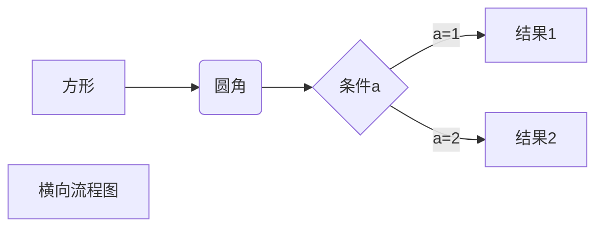
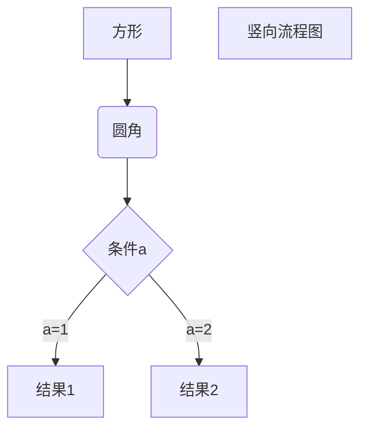
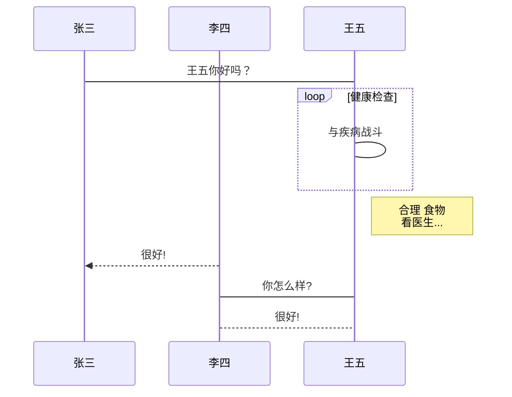
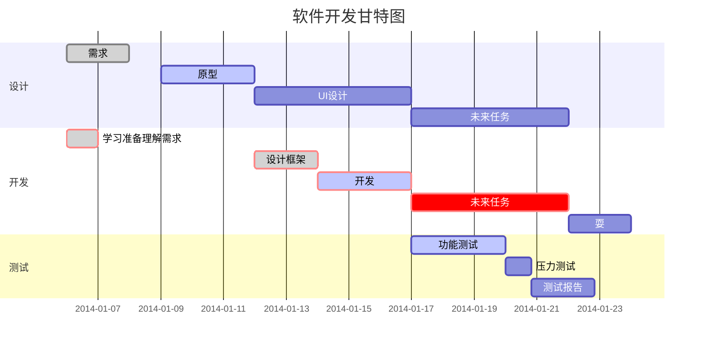

# __[:sunglasses:工作笔记:sunglasses:](https://github.com/benniao1996/1996)__
****
|[__:restroom:=:neckbeard:直男:neckbeard:__](https://github.com/benniao1996/1996)|[__:globe_with_meridians:=:cn:中国:cn:__](https://github.com/benniao1996/1996)|
| --- | ---
|[__:couple_with_heart: = :secret:保密:secret:__](https://github.com/benniao1996/1996)|[__:airplane:Telegram:airplane:=t.me/BenniaoHacker__](https://t.me/BenniaoHacker)|
****
[~~__**:shit: :shit: :shit: :shit: :shit: :shit: :shit: :shit: :shit: :shit: :shit: :shit: :shit: :shit: :shit: :shit: :shit: :shit: :shit: :shit: :shit: :shit: :shit: :shit: :shit: :shit: :shit: :shit: :shit: :shit: :shit: :shit: :shit: :shit: :shit: :shit: :shit: :shit: :shit: :shit: :shit:**__~~](https://t.me/BenniaoHacker)

| __*云服务商__ |[群联](http://www.ispqq.com/) | [AWS](https://aws.amazon.com/) | [阿里云](https://cn.aliyun.com/) | [腾讯云](https://cloud.tencent.com/) | [华为云](https://www.huaweicloud.com/intl/zh-cn/) | [Vultr](https://www.vultr.com/?ref=8606091-6G) | [AZURE](https://azure.microsoft.com/zh-cn/) | [百度云](https://cloud.baidu.com/) | [群英云](http://www.qy.com.cn/) | [恒创科技](https://www.henghost.com/) | [西部数码](https://www.west.cn/) | 

[~~__**:shit: :shit: :shit: :shit: :shit: :shit: :shit: :shit: :shit: :shit: :shit: :shit: :shit: :shit: :shit: :shit: :shit: :shit: :shit: :shit: :shit: :shit: :shit: :shit: :shit: :shit: :shit: :shit: :shit: :shit: :shit: :shit: :shit: :shit: :shit: :shit: :shit: :shit: :shit: :shit: :shit:**__~~](https://t.me/BenniaoHacker)

| __*WEB服务__ | [Nginx](https://nginx.org/)  | [Tengine](https://tengine.taobao.org/) | [Httpd](https://httpd.apache.org/) | [Tomcat](https://tomcat.apache.org/) | [IIS](https://www.iis.net/) | [宝塔](https://www.bt.cn/)  | 
| :----------: | :-----------: | :----------: | :-----------: | :----------: | :-----------: | :----------: | 
| ***历史版本下载*** | [Version-Nginx](https://nginx.org/en/download.html) | [Version-Tengine](https://tengine.taobao.org/download_cn.html) | [Version-Httpd](https://httpd.apache.org/download.cgi) | [Version-Tomcat](https://archive.apache.org/dist/tomcat/) | [Version-IIS](https://www.iis.net/downloads) | [Version-宝塔]() |
| ***使用帮助手册*** | [Doc-Nginx](https://nginx.org/en/docs/) | [Doc-Tengine](https://tengine.taobao.org/documentation_cn.html) | [Doc-Httpd](https://httpd.apache.org/docs/) | [Doc-Tomcat](https://tomcat.apache.org/index.html) | [Doc-IIS](https://docs.microsoft.com/zh-cn/iis/install/installing-iis-7/installing-necessary-iis-components-on-windows-vista) | [Doc-宝塔]() |
| ***常见故障处理*** | [FAQ-Nginx](https://nginx.org/en/docs/faq.html) | [FAQ-Tengine](https://tengine.taobao.org/faq_cn.html) | [FAQ-Httpd](https://cwiki.apache.org/confluence/display/httpd/FAQ) | [FAQ-Tomcat](https://cwiki.apache.org/confluence/display/TOMCAT/FAQ) | [FAQ-IIS](https://www.iis.net/downloads/category/troubleshoot) | [FAQ-宝塔]() |
| ***相关书籍资料*** | [PDF-Nginx](https://nginx.org/en/books.html) | [PDF-Tengine](https://tengine.taobao.org/book/) | [PDF-Httpd](https://cwiki.apache.org/confluence/display/httpd/) | [PDF-Tomcat](https://cwiki.apache.org/confluence/display/TOMCAT) | [PDF-IIS](https://docs.microsoft.com/en-us/previous-versions/windows/it-pro/windows-server-2008-R2-and-2008/dd349801(v=ws.10)) | [PDF-宝塔]() |
| ***漏洞修复情况*** | [Bug-Nginx](http://nginx.org/en/security_advisories.html) | [Bug-Tengine](https://tengine.taobao.org/changelog_cn.html) | [Bug-Httpd](https://httpd.apache.org/security/vulnerabilities_24.html) | [Bug-Tomcat](https://tomcat.apache.org/security.html) | [Bug-IIS](https://www.iis.net/downloads/community/category/secure) | [Bug-宝塔]() |
| ***项目源码地址*** | [SourceCode-Nginx](https://trac.nginx.org/nginx/browser?_ga=2.197435695.1080274919.1593757551-622746952.1593600593) | [SourceCode-Tengine](https://tengine.taobao.org/source_cn.html) | [SourceCode-Httpd](https://github.com/apache/httpd) | [SourceCode-Tomcat](https://tomcat.apache.org/source.html) | [SourceCode-IIS](https://www.iis.net/) | [SourceCode-宝塔]() |

[~~__**:shit: :shit: :shit: :shit: :shit: :shit: :shit: :shit: :shit: :shit: :shit: :shit: :shit: :shit: :shit: :shit: :shit: :shit: :shit: :shit: :shit: :shit: :shit: :shit: :shit: :shit: :shit: :shit: :shit: :shit: :shit: :shit: :shit: :shit: :shit: :shit: :shit: :shit: :shit: :shit: :shit:**__~~](https://t.me/BenniaoHacker)


| 数据库服务 | [MySQL](https://www.mysql.com/)  | [MyCat](https://mycat.org.cn/) | [MariaDB](https://mariadb.org/) | [Redis](https://redis.io/) | [MongDB](https://www.mongodb.com/) | [PhpMyAdmin](https://www.phpmyadmin.net/)  | 
| :----------: | :-----------: | :----------: | :-----------: | :----------: | :-----------: | :----------: | 
| ***历史版本下载*** | [Version-MySQL](http://nginx.org/en/download.html) | [Version-MyCat]() | [Version-MariaDB]() | [Version-Redis]() | [Version-MongDB]() | [Version-PhpMyAdmin]() |
| ***使用帮助手册*** | [Doc-MySQL]() | [Doc-MyCat]() | [Doc-MariaDB]() | [Doc-Redis]() | [Doc-MongDB]() | [Doc-PhpMyAdmin]() |
| ***常见故障处理*** | [FAQ-MySQL]() | [FAQ-MyCat]() | [FAQ-MariaDB]() | [FAQ-Redis]() | [FAQ-MongDB]() | [FAQ-PhpMyAdmin]() |
| ***相关书籍资料*** | [PDF-MySQL]() | [PDF-MyCat]() | [PDF-MariaDB]() | [PDF-Redis]() | [PDF-MongDB]() | [PDF-PhpMyAdmin]() |
| ***漏洞修复情况*** | [Bug-MySQL]() | [Bug-MyCat]() | [Bug-MariaDB]() | [Bug-Redis]() | [Bug-MongDB]() | [Bug-PhpMyAdmin]() |
| ***项目源码地址*** | [SourceCode-MySQL]() | [SourceCode-MyCat]() | [SourceCode-MariaDB]() | [SourceCode-Redis]() | [SourceCode-MongDB]() | [SourceCode-PhpMyAdmin]() |

[test](http://showterm.io/7b5f8d42ba021511e627e)

使用 <kbd>Ctrl</kbd>+<kbd>Alt</kbd>+<kbd>Del</kbd> 重启电脑

以下几个实例效果图如下：

1、横向流程图源码格式：


2、竖向流程图源码格式：


3、标准流程图源码格式：

```flow
st=>start: 开始框
op=>operation: 处理框
cond=>condition: 判断框(是或否?)
sub1=>subroutine: 子流程
io=>inputoutput: 输入输出框
e=>end: 结束框
st->op->cond
cond(yes)->io->e
cond(no)->sub1(right)->op
```
4、标准流程图源码格式（横向）：

```flow
st=>start: 开始框
op=>operation: 处理框
cond=>condition: 判断框(是或否?)
sub1=>subroutine: 子流程
io=>inputoutput: 输入输出框
e=>end: 结束框
st(right)->op(right)->cond
cond(yes)->io(bottom)->e
cond(no)->sub1(right)->op
```
5、UML时序图源码样例：

```sequence
对象A->对象B: 对象B你好吗?（请求）
Note right of 对象B: 对象B的描述
Note left of 对象A: 对象A的描述(提示)
对象B-->对象A: 我很好(响应)
对象A->对象B: 你真的好吗？
```
6、UML时序图源码复杂样例：

```sequence
Title: 标题：复杂使用
对象A->对象B: 对象B你好吗?（请求）
Note right of 对象B: 对象B的描述
Note left of 对象A: 对象A的描述(提示)
对象B-->对象A: 我很好(响应)
对象B->小三: 你好吗
小三-->>对象A: 对象B找我了
对象A->对象B: 你真的好吗？
Note over 小三,对象B: 我们是朋友
participant C
Note right of C: 没人陪我玩
```
7、UML标准时序图样例：


8、甘特图样例：


